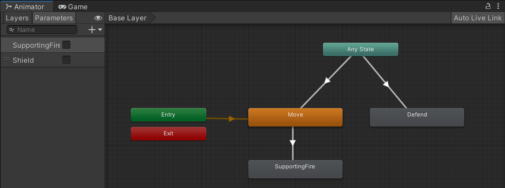

# Squad AI
3rd year exercice that aims at learning AI programming in game (decisions and movements). 

## Table of content ##
 - [Project description](#project-description)
 - [AI](#ai)
 - [Technology](#technologie)
 - [Organization](#organization)
 - [Credit](#credit)

## Project description ##
### Instruction ###
Create an NPC AI that can move in squads and interact with the player, as part of a real-time action game. 
You'll code an AI that allows an ally NPC to help and support the player in various circumstances. 
The NPC must be able to
- follow the player: staying close to the player, slightly behind him or her (adjustable distance)
- support fire: if the player shoots at a point on the map, the NPC must shoot at the same point (left click)
- protect the player: if an enemy shoots at the player, the NPC will go between the enemy and the player, pointing its shield toward the enemy
- heal the player: if the player is seriously wounded, the NPC will heal the player by moving near him and then by triggering a healing action
- cover fire: the player can right-click on an area of the map to request the action, it can be stopped at any time by right-clicking again

### Our choices ###
We've deviced to have 4 allies (AI / NPC). Each with a defined position. 
A shieldman to protect the player with a shield to reduce bullet damage.  
A medic to heal allies when their health points fall below a threshold ( current health <= 5 ). 
Two gunmen that will provide cover shots, if requested. 
When the allies aren't doing their specific jobs. Allies follow the player in predefined formations (shieldman in front, gunmen on both sides of the player and medic behind). Allies also fire to the same position as the player shoots. 

## AI ##
### Movement ###
We use the **NavMesh Agents of Unity**. 

### Decision making ###
For the decision-making part of AI, we use the **Finite State Machine (FSM)**. It's a simple system used to manage simple behaviors.  
It's a well-known system, it's not only used for AI but also for animations. 
Unity already has an FSM system implemented for its *animator*. We've decided to adapt it and use it for our AI. This allows us to have clean, easy-to-read and well-designed graphical interface. 

## Technologie ##
- Engine :  Unity 2022.3.4f1
- IDE : Visual Studio 2022
- Versionning : Gitlab (https://gitlabstudents.isartintra.com/projets/2023_gp_2026_squadai_gp_2026_squad_ai-groupe_02)

## Organization ##
| Tasks                                                         | Kristian | Vincent |
|---------------------------------------------------------------|:--------:|:-------:|
| Definition of IA behavior and project technology/architecture | x        | x       |
| AI Movement                                                   | x        |         |
| Covering fire                                                 |          | x       |
| Supporting fire                                               |          | x       |
| Heal                                                          | x        |         |
| Defend                                                        |          | x       |
| UI (health bar, action bar)                                   | x        |         |
| Documentation                                                 | x        | x       |

## Credit ##
Exercice done at **ISART DIGITAL**  
Authors : Kristian GOUPIL, Vincent DEVINE  
Special thanks : Florian Wolf  
Project start : 03-10-2023  
Project end : 23-10-2023  
